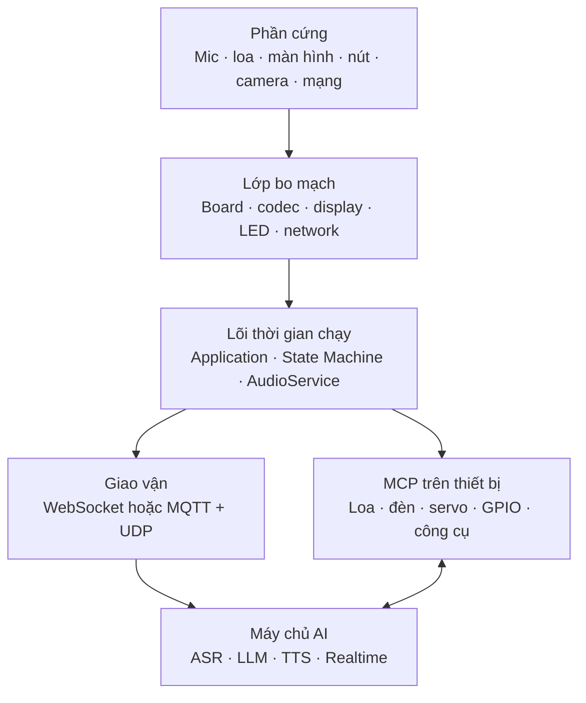
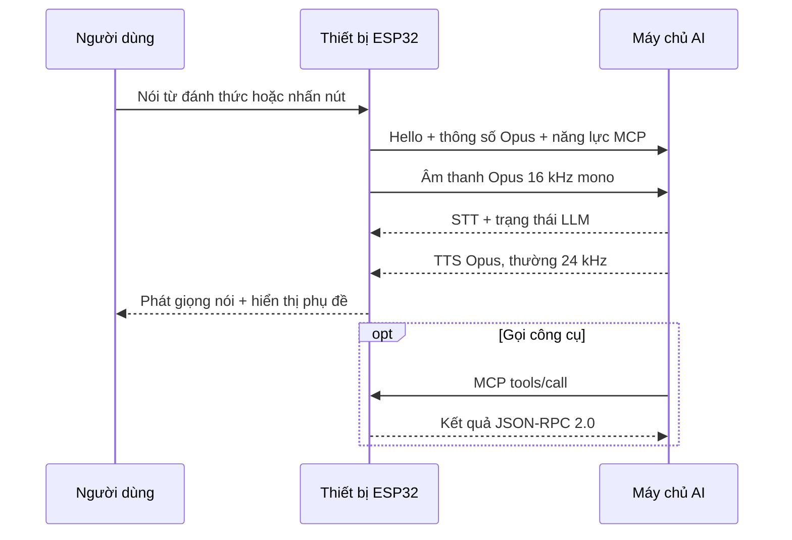

# 🇻🇳 XiaoZhi ESP32 Việt Nam

> Firmware trợ lý giọng nói mã nguồn mở cho ESP32, được Việt hóa và tổ chức để cộng đồng Việt Nam có thể học tập, chế tạo thiết bị, kết nối mô hình AI và phát triển sản phẩm lâu dài.

[](LICENSE)
[](https://github.com/espressif/esp-idf/releases/tag/v6.0.2)
[](main/assets/locales/vi-VN/language.json)
[](https://github.com/78/xiaozhi-esp32)

**Ngôn ngữ:** Tiếng Việt | [English](README_EN.md) | [中文](README_zh.md) | [日本語](README_ja.md)

## 🌟 Dự án này là gì?

XiaoZhi ESP32 là firmware C/C++ chạy trên ESP-IDF, biến các bo mạch ESP32 thành thiết bị hội thoại AI có khả năng:

- đánh thức bằng giọng nói ngay trên thiết bị;
- thu, xử lý và nén âm thanh bằng Opus;
- truyền hội thoại qua WebSocket hoặc MQTT kết hợp UDP;
- nhận kết quả STT, phản hồi LLM và âm thanh TTS từ máy chủ;
- hiển thị phụ đề, trạng thái, biểu cảm và hình ảnh;
- điều khiển loa, đèn, servo, GPIO và thiết bị IoT qua MCP;
- cập nhật firmware và tài nguyên bằng OTA;
- hoạt động trên nhiều dòng chip, bo mạch, màn hình và phương thức kết nối mạng.

Kho này được phát triển từ mã nguồn MIT của [`78/xiaozhi-esp32`](https://github.com/78/xiaozhi-esp32). Nhánh Việt Nam ưu tiên:

1. tiếng Việt là ngôn ngữ mặc định;
2. tài liệu kỹ thuật rõ ràng bằng tiếng Việt;
3. giữ thay đổi hẹp để đồng bộ upstream thuận lợi;
4. không đưa mã dịch ngược, khóa bí mật hoặc tài sản không rõ giấy phép vào kho.

## 🧭 Phạm vi và nguồn gốc

| Thành phần | Trạng thái trong kho |
|---|---|
| Firmware `xiaozhi-esp32` | Mã nguồn chính, kế thừa giấy phép MIT |
| Giao diện và thông báo `vi-VN` | Có sẵn và được hiệu chỉnh cho tiếng Việt |
| Tài liệu kiến trúc tiếng Việt | Được bổ sung trong `docs/` |
| XAPK “Lily – AI Agent” do người dùng cung cấp | Chỉ phân tích tĩnh; không phân phối lại mã hoặc tài sản |
| Máy chủ AI | Không nằm trong firmware; có thể dùng dịch vụ tương thích hoặc tự triển khai |

> **Lưu ý:** XAPK `com.sensornotes.xiaozhi` là một ứng dụng Android/Wear OS độc lập, không phải mã nguồn firmware `78/xiaozhi-esp32`. Xem [báo cáo phân tích XAPK](docs/phan-tich-xapk-lily.md).

## 🏗️ Kiến trúc tổng thể



### Luồng hội thoại chính



### Các lớp quan trọng

| Lớp | Tệp chính | Trách nhiệm |
|---|---|---|
| Khởi động | `main/main.cc` | Khởi tạo NVS, tạo `Application`, chạy vòng lặp chính |
| Điều phối | `main/application.*` | Ghép mạng, giao thức, âm thanh, UI, OTA và MCP |
| Trạng thái | `main/device_state_machine.*` | Kiểm tra các chuyển trạng thái hợp lệ |
| Âm thanh | `main/audio/` | Đọc mic, AFE/AEC/VAD, đánh thức, Opus, phát loa |
| Giao thức | `main/protocols/` | Trừu tượng hóa WebSocket và MQTT + UDP |
| Phần cứng | `main/boards/` | Chân GPIO, codec, màn hình, mạng và biến thể bo mạch |
| Hiển thị | `main/display/`, `main/led/` | OLED/LCD/LVGL, biểu cảm, đèn trạng thái |
| Công cụ | `main/mcp_server.*` | Khai báo và thực thi công cụ MCP trên thiết bị |
| Cập nhật | `main/ota.*`, `main/assets.*` | OTA, phiên bản và gói tài nguyên |

Tài liệu chuyên sâu: [Kiến trúc hệ thống](docs/kien-truc-he-thong.md).

## 🎙️ Đường ống âm thanh

**Chiều thu:**

`Micro → AudioCodec → AudioInputTask → AudioEngine → hàng đợi PCM → OpusCodecTask → hàng đợi gửi → máy chủ`

**Chiều phát:**

`Máy chủ → hàng đợi giải mã → OpusCodecTask → hàng đợi phát → AudioOutputTask → AudioCodec → loa`

Các dòng ESP32-S3, ESP32-P4 và ESP32-S31 dùng `AfeAudioEngine` để tích hợp AFE, AEC, VAD và đánh thức. Những chip nhỏ hơn dùng `LiteAudioEngine`. Khung Opus mặc định dài 60 ms; âm thanh gửi lên là PCM 16-bit, mono, 16 kHz trước khi nén.

## 🔌 Giao thức kết nối

### WebSocket

- JSON điều khiển và Opus nhị phân đi chung một kết nối.
- Bắt tay gửi `hello`, phiên bản giao thức, năng lực MCP/AEC và thông số âm thanh.
- Hỗ trợ các sự kiện `listen`, `stt`, `tts`, `llm`, `mcp`, `system`, `alert`.
- Phù hợp cho triển khai đơn giản và máy chủ tự lưu trữ.

### MQTT + UDP

- MQTT truyền điều khiển và JSON.
- UDP truyền Opus theo thời gian thực.
- Âm thanh UDP dùng AES-CTR với khóa phiên do máy chủ cấp.
- Có số thứ tự gói để phát hiện gói cũ, đảo thứ tự hoặc thất lạc.

Tài liệu gốc của giao thức:

- [WebSocket](docs/websocket.md)
- [MQTT + UDP](docs/mqtt-udp.md)
- [MCP](docs/mcp-protocol.md)

## 🧠 Máy trạng thái

Firmware quản lý chặt các trạng thái:

`khởi động → cấu hình mạng/kích hoạt → chờ → kết nối → lắng nghe ↔ phát lời`

Các trạng thái bổ sung gồm nâng cấp OTA, kiểm tra âm thanh và lỗi nghiêm trọng. Mọi thay đổi trạng thái phải đi qua `Application::SetDeviceState()`; callback chạy ngoài tác vụ chính phải đưa công việc về `Application::Schedule()`.

## 🧩 Nền tảng được hỗ trợ

Snapshot hiện tại có **139 thư mục bo mạch** và **172 biến thể build**. Danh sách luôn thay đổi theo upstream; hãy lấy số liệu chính xác bằng:

```bash
python scripts/build.py --list-boards
```

Các họ chip chính:

- ESP32
- ESP32-C3, ESP32-C5, ESP32-C6
- ESP32-S3, ESP32-S31
- ESP32-P4

Các kiểu mạng có thể gồm Wi-Fi, Ethernet, USB RNDIS và modem 4G Cat.1 tùy bo mạch.

## 🚀 Cài đặt nhanh

### 1. Chuẩn bị môi trường

- Git
- Python 3
- VS Code/Cursor với tiện ích ESP-IDF
- **ESP-IDF 6.0.2** được khuyến nghị
- Cáp USB dữ liệu và trình điều khiển phù hợp với bo mạch

Linux thường biên dịch nhanh và ít gặp lỗi trình điều khiển hơn. Windows vẫn dùng được qua ESP-IDF PowerShell hoặc ESP-IDF Command Prompt.

### 2. Tải mã nguồn

```bash
git clone https://github.com/Base27-CVNSS/xiaozhi.git
cd xiaozhi
```

### 3. Kích hoạt ESP-IDF

Linux/macOS:

```bash
source /duong-dan/esp-idf/export.sh
idf.py --version
```

Windows PowerShell:

```powershell
C:\Espressif\frameworks\esp-idf-v6.0.2\export.ps1
idf.py --version
```

### 4. Chọn đúng bo mạch và build

```bash
python scripts/build.py --list-boards
python scripts/build.py <thu-muc-bo-mach> --name <ten-bien-the> --language vi-VN
```

Ví dụ với cấu hình breadboard ESP32-S3 Wi-Fi:

```bash
python scripts/build.py bread-compact-wifi --name bread-compact-wifi --language vi-VN
```

### 5. Nạp và theo dõi log

Sau khi cấu hình đúng target và cổng nối tiếp:

```bash
idf.py flash monitor
```

Nhấn `Ctrl+]` để thoát màn hình log.

## 🇻🇳 Cấu hình tiếng Việt

Tiếng Việt đã là lựa chọn mặc định của bản phân phối này. Có ba cách kiểm soát:

```bash
# Cách ổn định nhất cho build tự động
python scripts/build.py <bo-mach> --name <bien-the> --language vi-VN

# Hoặc chọn trong menu
idf.py menuconfig
# Xiaozhi Assistant → Default Language → Vietnamese
```

Tệp ngôn ngữ:

```text
main/assets/locales/vi-VN/language.json
```

Nếu thiếu một tệp âm thanh tiếng Việt, hệ thống hiện dùng âm thanh `en-US` tương ứng làm phương án dự phòng. Đây là cơ chế của upstream, không phải lỗi chọn ngôn ngữ.

## 🧰 Phát triển bo mạch mới

Chuỗi cấu hình một bo mạch là:

`config.json → scripts/build.py → main/Kconfig.projbuild → main/CMakeLists.txt → mã bo mạch + config.h`

Nguyên tắc bắt buộc:

- không đổi chân của bo mạch hiện có để phục vụ phần cứng khác;
- mỗi phần cứng mới phải có tên bo mạch/biến thể riêng;
- chỉ có đúng một factory `DECLARE_BOARD(...)` trong mỗi bản build;
- lõi chỉ phụ thuộc giao diện `Board`, không phụ thuộc lớp bo mạch cụ thể;
- camera, màn hình, LED, pin và đèn nền luôn phải được xem là năng lực tùy chọn.

Đọc [hướng dẫn bo mạch tùy chỉnh](docs/custom-board.md) trước khi triển khai.

## 🔄 Đồng bộ với mã nguồn gốc

Kho đặt remote nguồn gốc là `upstream`:

```bash
git remote add upstream https://github.com/78/xiaozhi-esp32.git
git fetch upstream
git switch main
git merge --ff-only upstream/main
```

Nếu nhánh Việt Nam có commit riêng, hãy rebase hoặc tạo PR đồng bộ có kiểm soát. Không sửa hàng loạt tên lớp, định danh C++ hoặc comment lõi chỉ để dịch ngôn ngữ; việc đó làm tăng xung đột và khó nhận bản vá bảo mật từ upstream.

Quy trình đầy đủ: [Đồng bộ upstream](docs/dong-bo-upstream.md).

## 🔐 An toàn và quyền riêng tư

- Không ghi token, mật khẩu Wi-Fi, khóa MQTT, khóa API hoặc chứng chỉ riêng vào Git.
- Dùng TLS cho WebSocket/MQTT khi triển khai ngoài mạng tin cậy.
- UDP AES-CTR chỉ bảo vệ âm thanh khi khóa phiên được trao đổi an toàn.
- Kiểm tra URL OTA, chữ ký/nguồn firmware và phân vùng trước khi phát hành.
- MCP là bề mặt điều khiển thiết bị: chỉ công bố công cụ cần thiết, xác thực phía máy chủ và giới hạn công cụ đặc quyền.
- Không tái sử dụng khóa hay tài nguyên trích xuất từ ứng dụng Android đóng.

Nếu phát hiện lỗ hổng, không đăng khóa hoặc dữ liệu nhạy cảm trong issue công khai.

## 🗂️ Cấu trúc kho

```text
.
├── main/
│   ├── application.*          # Điều phối cấp cao
│   ├── device_state_machine.* # Máy trạng thái
│   ├── audio/                 # Thu, xử lý, Opus, phát
│   ├── boards/                # Phần cứng và biến thể
│   ├── protocols/             # WebSocket, MQTT + UDP
│   ├── display/ và led/       # Giao diện thiết bị
│   └── assets/locales/vi-VN/  # Tài nguyên tiếng Việt
├── docs/                      # Tài liệu kỹ thuật
├── scripts/                   # Build, sinh ngôn ngữ, công cụ phát hành
└── .github/workflows/         # Kiểm thử và build tự động
```

## ✅ Kiểm thử trước khi gửi thay đổi

```bash
python3 -m unittest discover -s scripts/tests -v
python scripts/build.py --list-boards
```

Với thay đổi phần cứng hoặc lõi, cần build ít nhất một biến thể đại diện cho chip/mạng bị ảnh hưởng. Build thành công không thay thế kiểm thử mic, loa, nút, màn hình, camera, AEC, đánh thức, ngắt lời, mất mạng và OTA trên thiết bị thật.

## 🤝 Đóng góp

Đóng góp được chào đón cho:

- sửa và chuẩn hóa thuật ngữ tiếng Việt;
- tài liệu lắp ráp, sơ đồ chân và hướng dẫn bo mạch phổ biến tại Việt Nam;
- máy chủ AI tự lưu trữ tương thích;
- công cụ MCP cho nhà thông minh, giáo dục và IoT;
- kiểm thử độ trễ, AEC, VAD và khả năng ngắt lời;
- bản vá từ upstream cần tích hợp vào nhánh Việt Nam.

Đọc [Hướng dẫn đóng góp](CONTRIBUTING.md) trước khi mở pull request.

## 📜 Giấy phép và ghi công

Dự án sử dụng [Giấy phép MIT](LICENSE).

Nguồn gốc:

- [`78/xiaozhi-esp32`](https://github.com/78/xiaozhi-esp32)
- Shenzhen Xinzhi Future Technology Co., Ltd.
- các tác giả và cộng tác viên upstream
- cộng đồng duy trì bản tiếng Việt tại Base27-CVNSS

Việc giữ nguyên thông báo bản quyền và giấy phép MIT là bắt buộc khi sao chép hoặc phân phối phần mềm.
