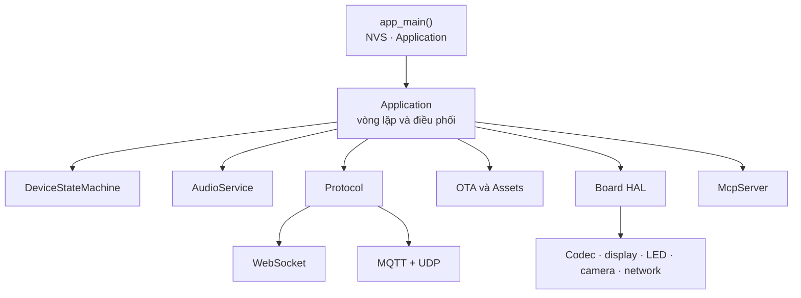
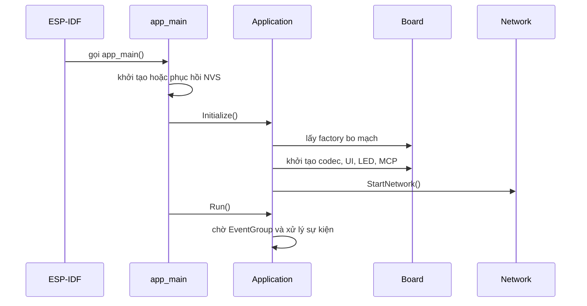
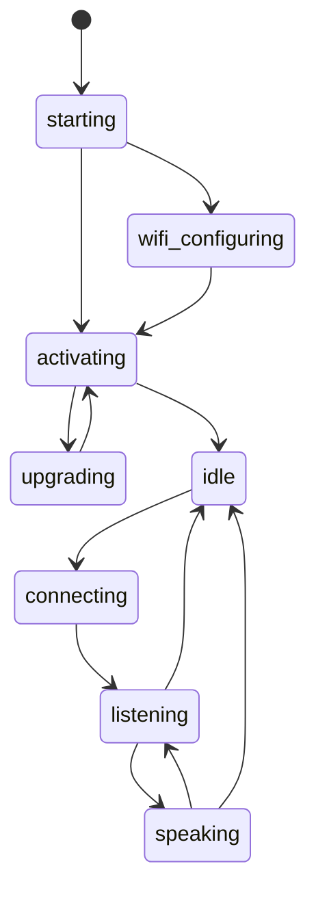
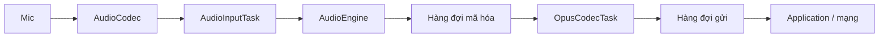
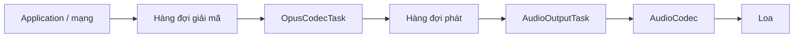

# Kiến trúc hệ thống XiaoZhi ESP32

Tài liệu này mô tả kiến trúc theo mã nguồn tại snapshot upstream `dd99da00dc4c89ed4ab07fcec038c03f13f4de50`. Khi triển khai máy chủ hoặc bo mạch mới, luôn đối chiếu lại mã hiện hành vì giao thức, SDK và ma trận phần cứng có thể thay đổi.

## 1. Mục tiêu thiết kế

Firmware giải quyết năm bài toán chính:

1. cô lập khác biệt phần cứng sau giao diện `Board`;
2. giữ đường âm thanh thời gian thực tách khỏi vòng lặp ứng dụng;
3. dùng một máy trạng thái để ngăn chuyển trạng thái sai;
4. che giấu khác biệt WebSocket và MQTT + UDP sau giao diện `Protocol`;
5. mở rộng khả năng thiết bị qua công cụ MCP thay vì gắn logic IoT vào hội thoại.

Đây là firmware đầu cuối. ASR, LLM và TTS thường chạy trên máy chủ; thiết bị chịu trách nhiệm đánh thức, thu/phát âm thanh, trạng thái, giao diện, phần cứng, giao thức và công cụ MCP.

## 2. Bản đồ thành phần



| Thành phần | Vai trò | Điểm vào chính |
|---|---|---|
| `main/main.cc` | Khởi động NVS và ứng dụng | `app_main()` |
| `Application` | Điều phối sự kiện, kết nối và phiên thoại | `Initialize()`, `Run()` |
| `DeviceStateMachine` | Kiểm tra và phát thông báo chuyển trạng thái | `TransitionTo()` |
| `AudioService` | Đường thu/phát, hàng đợi và Opus | `Initialize()`, `Start()` |
| `AudioEngine` | AFE hoặc xử lý nhẹ theo dòng chip | `AfeAudioEngine`, `LiteAudioEngine` |
| `Protocol` | Hợp đồng giao vận chung | `OpenAudioChannel()`, `SendAudio()` |
| `Board` | Giao diện năng lực phần cứng | `GetAudioCodec()`, `GetNetwork()` |
| `McpServer` | Khám phá và gọi công cụ JSON-RPC | `AddTool()`, `ParseMessage()` |
| `Ota`, `Assets` | Cấu hình máy chủ, firmware và tài nguyên | kiểm tra phiên bản, tải và áp dụng |

## 3. Chuỗi khởi động



`Application::Initialize()` đăng ký callback trước khi mạng hoạt động. Callback có thể đến từ tác vụ mạng, âm thanh hoặc timer; mọi thay đổi có ảnh hưởng tới ứng dụng phải được chuyển về tác vụ chính bằng event bit hoặc `Application::Schedule()`.

## 4. Vòng lặp sự kiện

`Application::Run()` chờ các bit trong `EventGroup`. Các nhóm sự kiện chính:

| Nhóm | Event bit tiêu biểu | Tác dụng |
|---|---|---|
| Lập lịch | `MAIN_EVENT_SCHEDULE` | Chạy callback trong `main_tasks_` |
| Âm thanh gửi | `MAIN_EVENT_SEND_AUDIO` | Lấy gói Opus và chuyển cho `Protocol` |
| Đánh thức/VAD | `MAIN_EVENT_WAKE_WORD_DETECTED`, `MAIN_EVENT_VAD_CHANGE` | Mở phiên, cập nhật trạng thái thoại |
| Người dùng | `MAIN_EVENT_TOGGLE_CHAT`, `START_LISTENING`, `STOP_LISTENING` | Điều khiển phiên bằng nút/UI |
| Mạng | `NETWORK_CONNECTED`, `NETWORK_DISCONNECTED` | Tạo/hủy tài nguyên giao thức |
| Hệ thống | `ACTIVATION_DONE`, `CLOCK_TICK`, `STATE_CHANGED` | Kích hoạt, timer, cập nhật UI |
| Phát âm thanh | `PLAYBACK_DRAINED` | Chuyển an toàn từ phát sang nghe |

Hàng đợi callback có khóa `mutex_`. Không được chạy tác vụ chặn lâu trong vòng lặp này vì sẽ làm trễ mạng, UI và hội thoại.

## 5. Máy trạng thái thiết bị

### 5.1 Danh sách trạng thái

| Trạng thái | Ý nghĩa |
|---|---|
| `unknown` | Trạng thái trước khởi động |
| `starting` | Đang khởi tạo |
| `wifi_configuring` | Đang cấp cấu hình mạng |
| `activating` | Đang kiểm tra OTA/cấu hình máy chủ/kích hoạt |
| `upgrading` | Đang cập nhật |
| `idle` | Sẵn sàng |
| `connecting` | Đang mở kênh hội thoại |
| `listening` | Đang gửi âm thanh người dùng |
| `speaking` | Đang phát phản hồi TTS |
| `audio_testing` | Kiểm tra mic/loa |
| `fatal_error` | Lỗi không thể tự phục hồi |

### 5.2 Chuyển trạng thái điển hình



`DeviceStateMachine::IsValidTransition()` là nguồn sự thật. Chuyển sai bị từ chối và ghi log. `fatal_error` không có đường ra; thiết bị cần hành động của người dùng hoặc khởi động lại.

## 6. Kiến trúc âm thanh

### 6.1 Chiều thu



- `AudioInputTask` đọc PCM từ codec đúng một lần.
- `AudioEngine` thực hiện đường xử lý phù hợp với chip.
- Khung vào là PCM 16-bit, mono, 16 kHz.
- `OpusCodecTask` nén khung 60 ms.
- Hàng đợi có giới hạn để tránh tăng RAM không kiểm soát.

### 6.2 Chiều phát



Máy chủ thường trả Opus 24 kHz. `AudioService` cấu hình decoder theo thông số bắt tay và lấy mẫu lại nếu codec đầu ra dùng tần số khác.

### 6.3 Engine theo chip

| Chip | Engine | Khả năng chính |
|---|---|---|
| ESP32-S3, ESP32-P4, ESP32-S31 | `AfeAudioEngine` | AFE, AEC, VAD, WakeNet/MultiNet |
| ESP32, C3, C5, C6 | `LiteAudioEngine` | Đường PCM nhẹ, WakeNet độc lập nếu cấu hình |

Trên target AFE, đánh thức và uplink dùng chung một AFE để tránh hai pipeline tốn bộ nhớ. Bộ đệm vòng PSRAM giữ tối đa khoảng hai giây âm thanh gần nhất khi bật tải âm thanh từ đánh thức.

### 6.4 AEC và ngắt lời

`AecMode` có ba chế độ:

- tắt AEC;
- AEC phía thiết bị;
- AEC phía máy chủ.

Chế độ thời gian thực yêu cầu AEC phù hợp. Khi người dùng đánh thức trong lúc TTS đang phát, firmware có thể gửi `abort` với lý do `wake_word_detected`, dừng phát và chuyển sang nghe. Để tránh tự thu phần đuôi TTS, luồng chuyển trạng thái chờ sự kiện `PLAYBACK_DRAINED`.

## 7. Lớp giao thức

`Protocol` định nghĩa các callback:

- kết nối/ngắt kết nối;
- mở/đóng kênh âm thanh;
- JSON đến;
- âm thanh đến;
- lỗi mạng.

Và các thao tác:

- `Start()`;
- `OpenAudioChannel()` / `CloseAudioChannel()`;
- `SendAudio()`;
- `SendStartListening()` / `SendStopListening()`;
- `SendAbortSpeaking()`;
- `SendMcpMessage()`.

Nhờ đó `Application` không cần biết phiên đang chạy trên WebSocket hay MQTT + UDP.

### 7.1 WebSocket

WebSocket truyền cả JSON và Opus:

1. thiết bị kết nối với các header nhận dạng/xác thực;
2. thiết bị gửi `hello`;
3. máy chủ trả `hello`, `session_id` và thông số audio;
4. hai phía trao đổi JSON và frame Opus;
5. timeout hoặc disconnect đóng kênh và đưa thiết bị về `idle`.

Phiên bản nhị phân:

- v1: frame Opus thô;
- v2: có `version`, `type`, `timestamp`, `payload_size`;
- v3: header gọn gồm `type`, `reserved`, `payload_size`.

### 7.2 MQTT + UDP

- MQTT giữ kết nối điều khiển, `hello`, STT/TTS/MCP và trạng thái.
- Máy chủ cấp địa chỉ UDP, khóa và nonce trong `hello`.
- UDP mang Opus đã mã hóa AES-CTR.
- `sequence` và `timestamp` hỗ trợ phát hiện phát lại, đảo thứ tự và khoảng trống.

MQTT/TLS và quá trình trao đổi khóa phải được bảo vệ; AES-CTR trên UDP không tự xác thực nội dung.

## 8. Thông điệp hội thoại

| Hướng | `type` | Chức năng |
|---|---|---|
| Thiết bị → máy chủ | `hello` | Khai báo transport, audio, MCP/AEC |
| Thiết bị → máy chủ | `listen` | Bắt đầu/dừng nghe hoặc báo từ đánh thức |
| Thiết bị → máy chủ | `abort` | Dừng TTS/phiên |
| Hai chiều | `mcp` | JSON-RPC 2.0 |
| Máy chủ → thiết bị | `stt` | Văn bản nhận dạng |
| Máy chủ → thiết bị | `tts` | Bắt đầu/dừng/câu đang phát |
| Máy chủ → thiết bị | `llm` | Biểu cảm hoặc nội dung UI |
| Máy chủ → thiết bị | `system` | Lệnh hệ thống, ví dụ reboot |
| Máy chủ → thiết bị | `alert` | Cảnh báo hiển thị |

## 9. MCP trên thiết bị

Thiết bị đóng vai trò MCP server, backend là MCP client. Payload bên trong transport tuân theo JSON-RPC 2.0.

Quy trình:

1. `hello` thông báo `features.mcp = true`;
2. backend gọi `initialize`;
3. backend gọi `tools/list`, có phân trang;
4. backend gọi `tools/call`;
5. thiết bị trả `result` hoặc `error`.

Có hai nhóm công cụ:

- công cụ thường: AI có thể nhìn thấy;
- công cụ chỉ dành cho người dùng: ẩn mặc định, dùng cho hành động đặc quyền như reboot, nâng cấp hoặc chụp màn hình.

Không biến mọi hàm phần cứng thành công cụ tự động. Mỗi công cụ cần tên ổn định, mô tả chính xác, schema đầu vào chặt và kiểm tra quyền phía máy chủ.

## 10. Trừu tượng phần cứng

`Board` là ranh giới giữa lõi và thiết bị:

- bắt buộc: loại bo, codec, mạng, trạng thái mạng, tiết kiệm điện;
- tùy chọn: display, LED, backlight, camera, pin, nhiệt độ.

Mỗi bản build chỉ xuất một factory:

```cpp
DECLARE_BOARD(TenLopBoMach);
```

Các thành phần lõi phải kiểm tra con trỏ tùy chọn trước khi sử dụng. Không được include `config.h` của bo cụ thể vào lõi.

Chuỗi chọn biến thể:

`boards/**/config.json → scripts/build.py → Kconfig → CMake → source + config.h`

Tên bo và biến thể ảnh hưởng nhận dạng OTA; không đổi tên tùy tiện sau khi đã phát hành.

## 11. OTA và tài nguyên

Khi mạng sẵn sàng, thiết bị:

1. lấy cấu hình OTA;
2. kiểm tra phiên bản firmware và tài nguyên;
3. nhận thông số kết nối máy chủ;
4. thực hiện kích hoạt nếu cần;
5. chuyển về `idle`.

Tài nguyên ngôn ngữ được chọn từ `main/assets/locales/<locale>/`. Nếu file âm thanh của locale không tồn tại, CMake có thể lấy file tương ứng từ `en-US`.

URL OTA là bề mặt tin cậy quan trọng. Bản phát hành riêng cần:

- TLS;
- kiểm soát nguồn firmware;
- kiểm tra phiên bản/chống hạ cấp nếu mô hình đe dọa yêu cầu;
- quy trình rollback;
- ma trận phân vùng phù hợp dung lượng flash.

## 12. Mô hình đồng thời

| Ngữ cảnh | Công việc |
|---|---|
| Main task | Máy trạng thái, UI, vòng lặp sự kiện |
| `AudioInputTask` | Đọc mic và cấp dữ liệu cho engine |
| `AudioOutputTask` | Đưa PCM ra codec |
| `OpusCodecTask` | Mã hóa/giải mã Opus |
| AFE fetch task | Lấy kết quả AFE trên S3/P4/S31 |
| Network callbacks | Nhận dữ liệu và trạng thái transport |
| Timer callbacks | Đồng hồ, điện năng âm thanh |

Quy tắc an toàn:

- callback ngoài main task không sửa trực tiếp trạng thái ứng dụng;
- không chặn main/audio task bằng I/O dài;
- dùng hàng đợi hữu hạn;
- tránh cấp phát lớn lặp lại trong đường audio;
- giữ quyền sở hữu `cJSON` rõ ràng;
- khóa NVS là API lâu dài, thay đổi cần migration.

## 13. Điểm mở rộng đúng

| Muốn mở rộng | Vị trí phù hợp |
|---|---|
| Bo mạch mới | `main/boards/<nhà-sản-xuất>/<bo>/` |
| Codec mới | `main/audio/codecs/` và lớp bo mạch |
| Màn hình/UI | `main/display/` |
| Giao thức truyền mới | Lớp con của `Protocol` |
| Công cụ IoT | `McpServer` hoặc `InitializeTools()` của bo |
| Dòng chữ giao diện | `main/assets/locales/<locale>/language.json` |
| Hành vi ứng dụng chung | `Application`, sau khi kiểm tra cả hai transport |

## 14. Kiểm thử kiến trúc

### Kiểm thử host

```bash
python3 -m unittest discover -s scripts/tests -v
```

### Kiểm kê cấu hình

```bash
python scripts/build.py --list-boards
python scripts/build.py --list-languages
```

### Kiểm thử phần cứng tối thiểu

- khởi động và cấp Wi-Fi;
- mic/loa và mức âm lượng;
- đánh thức, VAD và AEC;
- phiên WebSocket hoặc MQTT + UDP;
- mất mạng và kết nối lại;
- ngắt lời khi TTS đang phát;
- màn hình/LED/camera nếu có;
- OTA và phục hồi khi cập nhật lỗi.

Build thành công chỉ xác minh biên dịch; không xác minh dây nối, clock I2S, gain mic, echo âm học, nguồn điện hoặc chất lượng RF.

## 15. Tài liệu tham chiếu trong kho

- `main/audio/README.md`
- `docs/websocket.md`
- `docs/mqtt-udp.md`
- `docs/mcp-protocol.md`
- `docs/mcp-usage.md`
- `docs/custom-board.md`
- `docs/esp-idf-6-migration.md`
- `docs/code_style.md`
