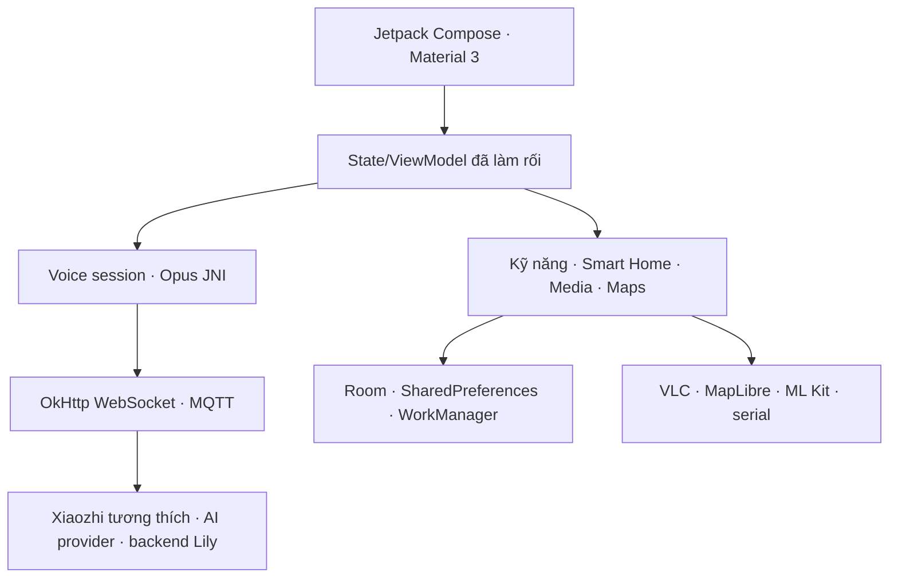

# Báo cáo phân tích tĩnh XAPK “Lily – AI Agent”

## 1. Kết luận điều hành

Tệp XAPK được cung cấp là ứng dụng Android/Wear OS:

- tên hiển thị: **Lily**;
- package: `com.sensornotes.xiaozhi`;
- phiên bản: `2.5.2` (`versionCode 25200`);
- không phải firmware `xiaozhi-esp32`;
- không có bằng chứng trong gói cho phép công bố lại toàn bộ mã, tài nguyên hoặc mô hình;
- có cơ chế Google Play License/PairIP và nhiều chuỗi bí mật được làm rối.

Vì vậy kho mã nguồn mở này **không chứa mã Java/Kotlin dịch ngược, khóa, chữ ký, ảnh, Live2D, mô hình ML hoặc thư viện native lấy từ XAPK**. Báo cáo chỉ ghi nhận kiến trúc và các quan sát kỹ thuật cần thiết để tham khảo.

## 2. Dấu vân tay tệp

| Thuộc tính | Giá trị |
|---|---|
| Định dạng | XAPK/ZIP, APK chia tách |
| Kích thước tệp XAPK | 138.995.021 byte |
| SHA-256 XAPK | `882807e2349b4dae1d777c6a2e71a809c805754891971cb345a8182565501d9c` |
| Minimum SDK | 22 |
| Target SDK | 35 |
| Compile SDK ghi trong manifest | 36 |
| ABI trong gói đã cung cấp | ARM64-v8a |

### Các APK thành phần

| Tệp | Vai trò | Kích thước |
|---|---|---:|
| `com.sensornotes.xiaozhi.apk` | Base APK, DEX, tài nguyên và manifest | 50.056.104 byte |
| `config.arm64_v8a.apk` | 10 thư viện native ARM64 | 88.749.162 byte |
| `config.en.apk` | Tài nguyên tiếng Anh | 57.753 byte |
| `config.fr.apk` | Tài nguyên tiếng Pháp | 33.177 byte |
| `config.xxhdpi.apk` | Tài nguyên mật độ XXHDPI | 96.213 byte |

## 3. Phương pháp

Phân tích được thực hiện ngoại tuyến:

1. kiểm tra cấu trúc ZIP và `manifest.json`;
2. tách base/split APK;
3. giải mã `AndroidManifest.xml`;
4. dịch DEX bằng JADX 1.5.4;
5. kiểm kê package, tài nguyên, asset và native library;
6. tìm dấu hiệu giao thức, module, endpoint và lớp bảo vệ;
7. không chạy ứng dụng, không đăng nhập và không gọi API của nhà phát hành.

### Mức bao phủ

- 2 file DEX;
- 8.945 đơn vị lớp được JADX đưa vào hàng xử lý;
- 12.585 file nguồn Java được dựng lại, phần lớn là dependency hoặc tên đã làm rối;
- 744 file tài nguyên được giải mã;
- 25 lỗi decompile còn lại;
- 32 gói kỹ năng có `SKILL.md`;
- 5 model Live2D;
- 10 thư viện native ARM64.

Số file Java không tương đương số file nguồn gốc. Trình dịch Kotlin, R8/ProGuard và tối ưu DEX có thể tách, gộp hoặc đổi tên lớp.

## 4. Vì sao không thể xem đây là “mã nguồn gốc”

Kết quả JADX không phải một dự án Android Studio có thể bảo trì:

- tên lớp nghiệp vụ chủ yếu bị đổi thành dạng `C1732cb`, `Lb1`, `Hf1` hoặc nằm trong `defpackage`;
- nhiều phương thức chỉ còn control flow gần đúng;
- mất comment, tên biến, cấu trúc module Gradle và lịch sử thiết kế;
- Kotlin coroutine, Compose compiler và R8 làm mã dựng lại khó đọc;
- 25 điểm không thể decompile đầy đủ;
- split resource phụ thuộc cấu hình thiết bị;
- native code chỉ có ELF đã biên dịch;
- lớp bảo vệ Google Play PairIP can thiệp vào application/license flow.

Có thể dùng kết quả này để kiểm toán, lập bản đồ chức năng và thiết kế lại theo clean-room. Không nên đổi tên vài lớp rồi gọi là mã nguồn mở.

## 5. Kiến trúc suy ra

### Công nghệ chính

| Lớp | Dấu hiệu trong gói | Nhận định |
|---|---|---|
| UI | AndroidX Compose, Material 3, Navigation Compose | UI Android hiện đại, không phải Flutter |
| DI | Dagger/Hilt | Tiêm phụ thuộc theo component |
| Dữ liệu | Room, SQLite, SharedPreferences | Lưu cấu hình, lịch sử và thiết bị |
| Công việc nền | WorkManager, Alarm/Job service | Lịch, đồng bộ, widget |
| Mạng | OkHttp, WebSocket, MQTT Android service | Hội thoại và IoT |
| Âm thanh | JNI Opus encoder/decoder | Nén/giải nén Opus native |
| AI/TTS | Thiết lập Gemini, ElevenLabs, Google Translate TTS | Hỗ trợ nhiều nguồn giọng/AI theo cấu hình |
| Thị giác | ML Kit Face, Text Recognition, model TFLite | Khuôn mặt và OCR |
| Bản đồ | MapLibre | Bản đồ tương tác |
| Media | LibVLC | Phát media |
| Nhân vật | Cubism/Live2D + PixiJS | 5 model nhân vật trong asset |
| Nhà thông minh | eWeLink, Broadlink, Home Assistant | Phát hiện/điều khiển thiết bị |
| Hệ thống | VoiceInteractionService, RecognitionService | Tích hợp vai trò trợ lý Android |
| Thương mại | Play Billing 7.0, PairIP, biometrics | Gói tính năng và kiểm tra giấy phép |

## 6. Đường hội thoại

Các dấu hiệu cho thấy ứng dụng hỗ trợ cả WebSocket và MQTT:

1. người dùng chọn/truyền cấu hình assistant;
2. app nhận `websocket_url`, `websocket_token` hoặc cấu hình MQTT;
3. mic được mã hóa Opus qua JNI;
4. JSON điều khiển và âm thanh đi tới server tương thích XiaoZhi;
5. phản hồi Opus được giải mã và phát;
6. ứng dụng có các trạng thái hoặc log liên quan WebSocket, TTS và MCP.

Một endpoint XiaoZhi công khai mặc định xuất hiện trong bytecode, cùng khả năng dùng URL WebSocket tự lưu trữ. Báo cáo không sao chép token, chữ ký hoặc chuỗi bí mật đã nhúng.

## 7. Module chức năng quan sát được

### Trợ lý và hội thoại

- nhiều hồ sơ assistant;
- hội thoại văn bản/giọng nói;
- Opus hai chiều;
- WebSocket và MQTT;
- cấu hình giọng TTS;
- Android voice interaction;
- MCP/công cụ phía thiết bị.

### Nhà thông minh

- eWeLink/Sonoff qua LAN và OAuth callback;
- Broadlink RM;
- Home Assistant;
- lưu thiết bị và lịch điều khiển;
- mô tả công cụ bằng tiếng Việt để LLM chọn đúng hành động.

### Công cụ cục bộ

32 kỹ năng đóng gói trong `assets/skills`, gồm:

- máy tính tuổi, BMI, khoản vay và tiết kiệm;
- đổi đơn vị, tiền tệ, mã Morse, hash;
- lịch âm, đếm ngược, bấm giờ, metronome;
- bản đồ, thời tiết, tra IP, Wikipedia;
- QR, markdown, ASCII art, từ điển emoji;
- theo dõi tâm trạng/chu kỳ;
- gửi email và một số tiện ích học tập.

### Thị giác và đa phương tiện

- OCR;
- phát hiện khuôn mặt;
- đo nhịp tim quang học bằng camera được mô tả trong chuỗi UI;
- bản đồ và dữ liệu giao thông;
- phát video/âm thanh bằng VLC;
- avatar Live2D và biểu cảm GIF.

## 8. Quyền Android

### Nhóm cần cho chức năng

| Nhóm | Quyền tiêu biểu | Lý do có thể |
|---|---|---|
| Âm thanh | `RECORD_AUDIO`, `MODIFY_AUDIO_SETTINGS` | Hội thoại |
| Camera | `CAMERA` | OCR, khuôn mặt, QR, đèn pin, PPG |
| Vị trí | `ACCESS_FINE_LOCATION`, `ACCESS_COARSE_LOCATION` | Bản đồ, thời tiết, Wi-Fi/BLE |
| Mạng | `INTERNET`, `ACCESS_NETWORK_STATE`, Wi-Fi multicast | Hội thoại, phát hiện thiết bị LAN |
| Bluetooth | scan/connect và quyền cũ | Thiết bị lân cận |
| Hệ thống | wake lock, notification, alarm, foreground service | Trợ lý/lịch nền |
| Lưu trữ | quyền đọc/ghi cũ với giới hạn SDK | Nhập/xuất file trên Android cũ |
| Thanh toán | `BILLING`, `CHECK_LICENSE` | Mua hàng và xác minh Play |
| Sinh trắc | fingerprint/biometric | Bảo vệ tính năng hoặc dữ liệu |

### Quyền có độ nhạy cao

- `QUERY_ALL_PACKAGES`;
- vị trí chính xác;
- camera và microphone;
- Bluetooth scan;
- full-screen intent;
- quyền robot riêng của UBT.

Ứng dụng triển khai các quyền này không đồng nghĩa hành vi xấu, nhưng bản clean-room nên xin quyền theo tính năng, giải thích mục đích và loại bỏ quyền không dùng.

## 9. Thành phần Android được khai báo

| Thành phần | Export | Ghi chú |
|---|---:|---|
| `MainActivity` | Có | Launcher, `singleTask` |
| `XiaoZhiInteractionService` | Có | Được bảo vệ bởi `BIND_VOICE_INTERACTION` |
| `XiaoZhiInteractionSessionService` | Có | Được bảo vệ bởi `BIND_VOICE_INTERACTION` |
| `XiaoZhiRecognitionService` | Có | Được bảo vệ bởi `BIND_VOICE_INTERACTION` |
| `EwelinkOAuthCallbackActivity` | Có | Custom scheme `lily://ewelink-callback` |
| `CalendarWidgetProvider` | Có | Widget lịch âm |
| `FileProvider` | Không | Cấp URI có kiểm soát |

## 10. Thư viện native ARM64

| Thư viện | Chức năng suy ra |
|---|---|
| `libapp.so` | JNI Opus encoder/decoder, có symbol debug |
| `libvlc.so`, `libvlcjni.so` | VLC media |
| `libmaplibre.so` | Bản đồ |
| `libmlkit_google_ocr_pipeline.so` | OCR |
| `libface_detector_v2_jni.so` | Phát hiện khuôn mặt |
| `libconscrypt_jni.so` | TLS provider |
| `libserial_port.so` | Giao tiếp serial |
| `libandroidx.graphics.path.so` | Đường vector AndroidX |
| `libc++_shared.so` | C++ runtime |

`libapp.so` chứa đường dẫn build C/C++ và symbol JNI cho `OpusEncoder`/`OpusDecoder`; đây là native library Android, không phải firmware ESP32.

## 11. Quan sát an toàn tĩnh

Đây là các điểm cần xem xét, không phải kết luận khai thác:

1. **Cho phép cleartext:** manifest đặt `usesCleartextTraffic="true"` để hỗ trợ thiết bị LAN/URL tự lưu trữ. Cần giới hạn bằng Network Security Config trong bản thiết kế mới.
2. **Bí mật phía client:** lớp `Secrets` làm rối URL, product ID và chữ ký. Obfuscation không bảo vệ được bí mật nằm trong APK.
3. **Custom URL scheme:** `lily://ewelink-callback` không có xác minh domain như Android App Links; cần kiểm tra state/PKCE và chống ứng dụng khác chiếm callback.
4. **Backup:** `allowBackup="true"`; cần đánh giá dữ liệu token, cấu hình assistant và thiết bị nhà thông minh.
5. **Phạm vi package:** `QUERY_ALL_PACKAGES` cần giải trình Play policy và thu hẹp nếu có thể.
6. **Log:** bytecode có log WebSocket và trạng thái token; production nên loại dữ liệu nhạy cảm và dùng redaction thống nhất.
7. **HTTP/WebSocket cục bộ:** xuất hiện URL `ws://` dùng cho phát triển/LAN; không dùng cleartext qua Internet.
8. **Tài sản bên thứ ba:** Live2D, VLC, ML Kit, model và JS minified có giấy phép riêng; phải lập SBOM/NOTICE trước khi phân phối lại.

## 12. So sánh với firmware `78/xiaozhi-esp32`

| Tiêu chí | XAPK Lily | Firmware xiaozhi-esp32 |
|---|---|---|
| Nền tảng | Android/Wear OS | ESP-IDF trên ESP32 |
| Ngôn ngữ | Kotlin/Java + C/C++ JNI | C/C++ |
| UI | Jetpack Compose | OLED/LCD/LVGL/LED |
| Audio | Android Audio + Opus JNI | AudioCodec + AFE/Lite + Opus |
| Mạng | Android OkHttp/MQTT | ESP-IDF WebSocket/MQTT/UDP |
| Khả năng | Trợ lý, tiện ích, media, map, smart home | Thiết bị thoại, phần cứng, MCP |
| Phân phối | Google Play split APK | Firmware/OTA |
| Giấy phép quan sát được | Không có giấy phép nguồn cho app | MIT |
| Có thể đưa vào kho này | Chỉ báo cáo/ý tưởng clean-room | Có, giữ copyright và MIT |

Hai hệ thống chia sẻ ý tưởng giao thức và Opus, nhưng không thể thay thế mã cho nhau.

## 13. Hướng tái phát triển hợp pháp

Nếu cần ứng dụng Android đồng hành:

1. viết đặc tả chức năng chỉ từ hành vi và giao thức công khai;
2. dùng mã nguồn Android XiaoZhi có giấy phép rõ ràng hoặc tạo dự án mới;
3. không sao chép class dựng lại, asset, model, secret hoặc UI độc quyền;
4. tách module `core-protocol`, `audio`, `mcp`, `storage`, `feature-*`;
5. dùng Keystore/EncryptedSharedPreferences cho token;
6. dùng TLS mặc định, chỉ cho phép cleartext theo host LAN do người dùng chọn;
7. có SBOM, `THIRD_PARTY_NOTICES` và kiểm tra giấy phép tự động;
8. viết test vector WebSocket/MQTT từ tài liệu giao thức công khai.

## 14. Giới hạn báo cáo

- Không phân tích động, không chặn TLS và không quan sát traffic thật.
- Không xác minh hành vi server.
- Không đánh giá tất cả 12.585 file dựng lại bằng tay.
- Không có source map/R8 mapping.
- Chỉ có split ARM64/EN/FR/XXHDPI trong XAPK được cung cấp.
- Một số nhận định kiến trúc là suy luận từ manifest, dependency, chuỗi và call site.

Mọi phát hiện bảo mật trước khi công bố cần được tái kiểm tra trên bản chính thức, môi trường kiểm thử có quyền và quy trình thông báo có trách nhiệm.
